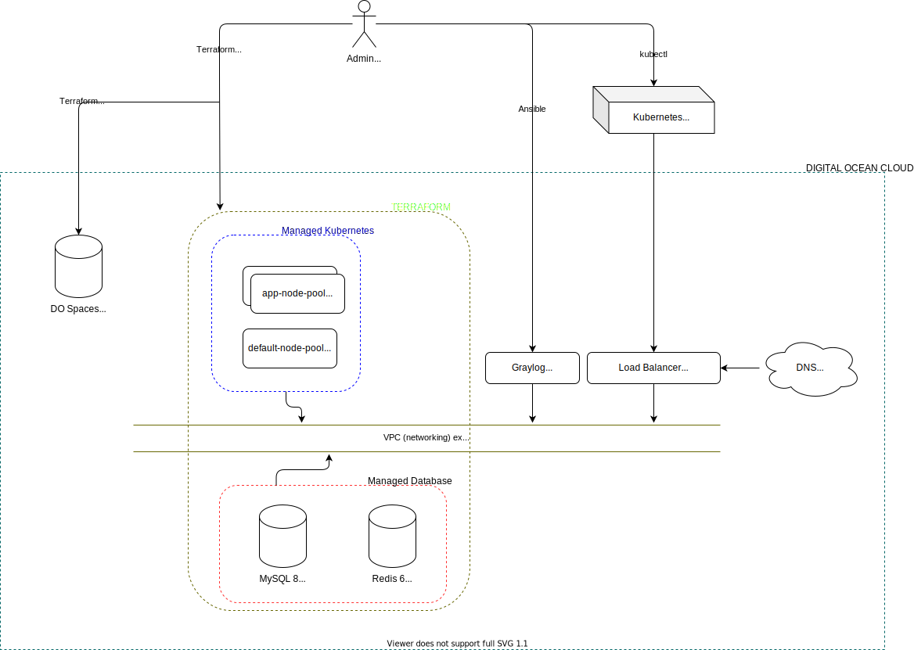

# Архитектура проекта

### Инфраструктурные компоненты
* Среды приложений:
  * Kubernetes (latest)
* Базы данных:
  * MySQL 8
  * Redis 6

---
## Обновление схемы

Для обновления удобно использовать встроенные в различные IDE и редакторы плагины, например для [VSCode](https://github.com/hediet/vscode-drawio). Плагин поддерживает редактирование и экспорт локальных файлов без необходимости храения их на хостингах.

При изменении изображения следует обновить исходный файл изображения в формате `.drawio`, провести его экспорт в формате SVG и по необходимости _(изменении названия, структуры каталогов)_ обновить ссылку в ARCHITECTURE.md